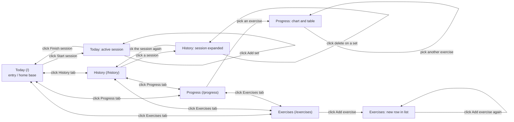

# 2. Wireframes & Component Breakdown

App: **Setlog: Workout Set Tracker** (React + Vite front end, Postgres behind a small Node API, single user).
Routes come from the [proposal](01-proposal.md): Today, History, Progress, Exercises.

---

## Step A: Screen map



- **First screen:** Today.
- **Home base:** the NavBar, which shows the same four tabs (Today, History, Progress, Exercises) on every screen and every state, so each screen reaches every other in one tap.
- **Dead ends:** none. Each in-screen action either stays on its screen or returns to it.

---

## Step B: Box sketches at two widths

Labels in the boxes are the component names from Step C.

### Today (`/`)

The screen has two states: **no active session** (a "Start session" button, plus a note that nothing is logged yet) and **active session** (sketched below).

**Phone (~375px)**

```
+--------------------------------------------+
| AppHeader: Setlog                   [date] |
+--------------------------------------------+
| FormField: Session note                    |
| [................................]         |
+--------------------------------------------+
| SetEntryForm                               |
|  ExercisePicker  [ Bench press  v ]        |
|  FormField Reps       FormField kg         |
|  [ 8      ]           [ 60      ]          |
|  [ Add set ]                               |
+--------------------------------------------+
| SetGroupList                               |
|  ExerciseSetGroup: Bench press             |
|    SetRow 1   8 x 60 kg        [x]         |
|    SetRow 2   6 x 65 kg        [x]         |
|  ExerciseSetGroup: Squat                   |
|    SetRow 1   5 x 80 kg        [x]         |
+--------------------------------------------+
| [ Finish session ]                         |
+--------------------------------------------+
| NavBar (bottom)                            |
| Today | History | Progress | Exercises     |
+--------------------------------------------+
```

**Desktop (~1200px, content capped at a max width and centered)**

```
+---------------------------------------------------------------------------------+
| AppHeader: Setlog     NavBar (top): Today  History  Progress  Exercises         |
+---------------------------------------------------------------------------------+
| FormField: Session note  [....................................................] |
+--------------------------------+------------------------------------------------+
| SetEntryForm (left, 1/3)       | SetGroupList (right, 2/3)                      |
|  ExercisePicker                |  ExerciseSetGroup: Bench press                 |
|  [ Bench press   v ]           |    SetRow 1   8 x 60 kg          [x]           |
|  FormField Reps  FormField kg  |    SetRow 2   6 x 65 kg          [x]           |
|  [ 8      ]      [ 60     ]    |  ExerciseSetGroup: Squat                       |
|  [ Add set ]                   |    SetRow 1   5 x 80 kg          [x]           |
|                                |                                                |
|  [ Finish session ]            |                                                |
+--------------------------------+------------------------------------------------+
```

### History (`/history`)

**Phone**

```
+--------------------------------------------+
| AppHeader                                  |
+--------------------------------------------+
| SessionCard  Sat 12 Sep                    |
|  Push day   3 exercises, 11 sets           |
|  [ v expand ]                              |
+--------------------------------------------+
| SessionCard  Wed 9 Sep (expanded)          |
|  ExerciseSetGroup: Bench press             |
|    SetRow 1   8 x 60 kg        [x]         |
|    SetRow 2   6 x 65 kg        [x]         |
+--------------------------------------------+
| SessionCard  Mon 7 Sep                     |
+--------------------------------------------+
| NavBar (bottom)                            |
| Today | History | Progress | Exercises     |
+--------------------------------------------+
```

**Desktop:** header and NavBar on top; `SessionList` becomes a **2-column grid** of `SessionCard`s. Cards expand in place.

### Progress (`/progress`)

**Phone**

```
+--------------------------------------------+
| AppHeader                                  |
+--------------------------------------------+
| ExercisePicker  [ Bench press  v ]         |
+--------------------------------------------+
| ProgressChart                              |
|  (best set per session, by date)           |
+--------------------------------------------+
| ProgressTable                              |
|  Date      | Best set                      |
|  12 Sep    | 8 x 65 kg                     |
|  9 Sep     | 8 x 62.5 kg                   |
+--------------------------------------------+
| NavBar (bottom)                            |
| Today | History | Progress | Exercises     |
+--------------------------------------------+
```

**Desktop:** NavBar on top; `ExercisePicker` above; below it a 2-column row with `ProgressChart` (left, 2/3) and `ProgressTable` (right, 1/3).

### Exercises (`/exercises`)

**Phone**

```
+--------------------------------------------+
| AppHeader                                  |
+--------------------------------------------+
| ExerciseForm                               |
|  FormField Name          [            ]    |
|  FormField Muscle group  [ Chest    v ]    |
|  [ Add exercise ]                          |
+--------------------------------------------+
| ExerciseList                               |
|  ExerciseRow  Bench press    [Chest]       |
|  ExerciseRow  Squat          [Legs]        |
|  ExerciseRow  Deadlift       [Back]        |
+--------------------------------------------+
| NavBar (bottom)                            |
| Today | History | Progress | Exercises     |
+--------------------------------------------+
```

**Desktop:** NavBar on top; a 2-column layout with `ExerciseForm` (left, 1/3) and `ExerciseList` (right, 2/3).

### Summary table

| Screen | Desktop layout | Phone layout (what stacks) | Navigates to |
| --- | --- | --- | --- |
| Today | 2 columns: form (1/3) beside set list (2/3); NavBar on top | Single column: note, form, set list, finish button; NavBar moves to the bottom; Reps and kg stay side by side | History, Progress, Exercises via NavBar |
| History | 2-column grid of session cards | 1 column of session cards | Today, Progress, Exercises via NavBar |
| Progress | Picker on top; chart (2/3) beside table (1/3) | Picker, chart, table stacked | Today, History, Exercises via NavBar |
| Exercises | 2 columns: form (1/3) beside list (2/3) | Form above list | Today, History, Progress via NavBar |

**What changes on a phone (becomes media queries):** the NavBar moves from the top to a fixed bottom bar; every 2-column row collapses to one stacked column; the session-card grid goes from 2 columns to 1. I will use a single breakpoint at about 768px.

---

## Step C: Component tree

| Level | What it is | Your components |
| --- | --- | --- |
| **Atoms** | smallest pieces | `Button`, `Input`, `Select`, `IconButton` (the delete "x"), `Tag` (muscle-group label) |
| **Molecules** | small groups of atoms | `FormField` (label + Input), `ExercisePicker` (label + Select of exercises), `SetRow` (set number, reps x weight, delete IconButton), `ExerciseRow` (name + Tag), `SessionCard` (date, note, summary, expand button), `NavItem` (link + label) |
| **Organisms** | whole sections | `AppHeader`, `NavBar` (NavItems), `SetEntryForm` (ExercisePicker + FormFields + Button), `ExerciseSetGroup` (exercise name + SetRows), `SetGroupList` (ExerciseSetGroups), `SessionList` (SessionCards), `ProgressChart`, `ProgressTable`, `ExerciseForm`, `ExerciseList` (ExerciseRows) |
| **Page / layout** | arranges organisms | `AppLayout` (AppHeader + NavBar + page outlet), `TodayPage`, `HistoryPage`, `ProgressPage`, `ExercisesPage` |

**Component tree for the busiest screen (Today):**

```
App                          (owns exercises, sessions, sets, activeSessionId, loading/error)
└─ AppLayout
   ├─ AppHeader
   ├─ NavBar
   │  └─ NavItem x4
   └─ TodayPage              (owns selectedExerciseId)
      ├─ FormField           (session note)
      ├─ SetEntryForm        (owns reps and weight inputs)
      │  ├─ ExercisePicker
      │  ├─ FormField x2     (reps, weight)
      │  └─ Button           (Add set)
      ├─ SetGroupList
      │  └─ ExerciseSetGroup xN
      │     └─ SetRow xM
      │        └─ IconButton (delete)
      └─ Button              (Finish session)
```

**Repeats named once (each is built one time and reused):**

| Component | Used in |
| --- | --- |
| `ExercisePicker` | `SetEntryForm` (Today) and `ProgressPage` |
| `SetRow` and `ExerciseSetGroup` | Today and the expanded `SessionCard` in History |
| `FormField` | `SetEntryForm`, `ExerciseForm`, the session note |
| `Tag` | `ExerciseRow` and anywhere a muscle group is shown |
| `Button` | every form and the Finish button |

**Level check:** atoms import nothing; molecules import only atoms; organisms import atoms and molecules; pages import organisms. No atom imports an organism.

---

## Step D: Sanity check

**Task walked through:** "Log bench press 8 x 60 kg and 6 x 65 kg, then check whether my bench is going up."

1. Open the app, land on **Today** (no active session). Tap **Start session**. The form and set list appear.
2. In `ExercisePicker` choose Bench press. Enter 8 and 60, tap **Add set**. A `SetRow` appears under a Bench press `ExerciseSetGroup`. Repeat with 6 and 65.
3. Tap **Finish session**. The screen returns to the no-active-session state.
4. Tap **Progress** in the NavBar, pick Bench press in `ExercisePicker`, and read `ProgressChart` and `ProgressTable`.
5. To fix a mistake, tap **History**, expand the session, and delete the wrong `SetRow`.

**What the walkthrough turned up:**

- **Missing state:** Progress needs its own `selectedExerciseId`, owned by `ProgressPage`. History needs an `expandedSessionId`, owned by `HistoryPage`. Exercises form inputs are owned by `ExerciseForm`. These were not in the proposal's state table.
- **Missing block:** the Today screen needs a "no active session" state with a **Start session** button. The proposal's block list only described the active state.
- **State ownership check:** every piece of state from the proposal has an owner. `exercises`, `sessions`, `sets`, `activeSessionId`, and `loading/error` live in `App` because more than one page uses them. `selectedExerciseId` (Today) lives in `TodayPage` and is passed to `SetEntryForm` as props. The reps and weight inputs live in `SetEntryForm`.
- **Navigation:** no screen is a dead end.

---

## What to keep

- Screen map becomes the routes (`/`, `/history`, `/progress`, `/exercises`) and the `NavBar`.
- Each labeled box becomes a component in `src/components/`, in `atoms/`, `molecules/`, `organisms/`, and `pages/` folders.
- The phone notes become the single media query at about 768px.
